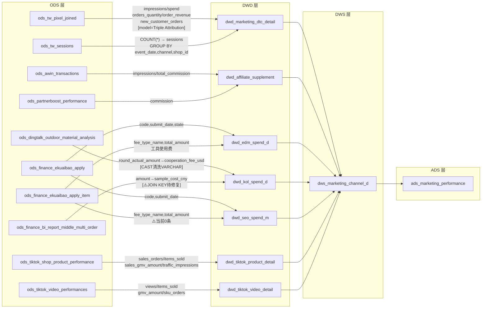

# 加工文档 — 报表3：营销表现表

**关联报表：** 营销推广-渠道效果
**需求时间：** 2026-04-20 | **上线时间：** 2026-05-18
**文档版本：** v2.0（已核对 Doris 真实表结构） | **日期：** 2026-04-24

---

## ODS 表名对照（文档旧名 → Doris 真实表名）

| 旧名（设计阶段） | Doris 真实表名 | 行数 | 备注 |
|---|---|---|---|
| `ods_tw_pixel_joined` | `ods_tw_pixel_joined` | 7,246 | 无 sessions 字段，sessions 单独在 `ods_tw_sessions` |
| `ods_dd_kol_payment` | `ods_dingtalk_outdoor_material_analysis` | 4,847（892条有效） | `amount_usd` 为 VARCHAR（含 '$' 符号） |
| `ods_kol_sample_records` | `ods_dingtalk_kol_tidwe_sample` | 317 | `tracking_number` ≠ `platform_order_no`，样品费 JOIN 逻辑待确认 |
| `ods_finance_multi_order` | `ods_finance_bi_report_middle_multi_order` | 12,992,010 | |
| `ods_hesi_expense` | `ods_finance_ekuaibao_apply`（表头）+ `ods_finance_ekuaibao_apply_item`（明细） | 139 / 292 | JOIN key: `code`；SEO 费用类型**当前 0 条**（见下方说明） |
| `ods_awin_performance` | `ods_awin_transactions` | 53 | |
| `ods_partnerboost` | `ods_partnerboost_performance` | 663 | |
| `ods_tiktok_product_perf` | `ods_tiktok_shop_product_performance` | 4,876 | 字段已扁平化，无嵌套数组 |
| `ods_tiktok_video_perf` | `ods_tiktok_video_performances` | 47,499 | 字段已扁平化，无嵌套数组 |
| `ods_cartsee_sms` / `ods_cartsee_edm` | **未入库** | — | EDM 短信费路径暂不可用 |

---

## 关键数据验证结论

| 验证项 | 结论 |
|---|---|
| `ods_tw_pixel_joined.model` 枚举值 | 仅 `'Triple Attribution'`，**无** `'Linear All'`；过滤条件需改为 `model = 'Triple Attribution'` |
| `ods_tw_pixel_joined` 是否有 sessions 字段 | **无**；sessions 数据在独立表 `ods_tw_sessions`（345,265行），需单独聚合 |
| `ods_dingtalk_kol_tidwe_sample.tracking_number` 能否 JOIN 多平台订单 | **不能**；tracking_number 格式（如 `1000220251112004290`）与 `platform_order_no`（Amazon 格式 `402-xxx`）不匹配，样品费路径暂挂起 |
| 合思费控 SEO 费用 | 过滤口径已更正：`a.title LIKE '%SEO%' OR i.consumption_reasons LIKE '%SEO%'`；月份归属从**标题**提取"YY年M月/YYYY年M月"；当前 Doris 中仍为 **0 条**（数据未录入），逻辑已就绪 |
| Affiliate spend | Awin: `total_commission`（日粒度，53行）；PB: `commission`（日粒度，663行）；日期字段为 `collect_date` |
| YouTube 与 KOL 内容关联 | `ods_youtube_video_stats.dingtalk_record_id` = `ods_dingtalk_kol_tidwe_content.record_id`，**直接 JOIN**，无需 URL 解析 |

---

## 整体数据血缘

```
ODS 层                                    DIM 层    DWD 层                           DWS 层                       ADS 层
────────────────────────────────────────────────────────────────────────────────────────────────────────────────────────────
                                                                                     ┌─────────────────────┐
ods_tw_pixel_joined ──┐                                                              │                     │
ods_tw_sessions ──────┤─(channel归因CASE WHEN+JOIN dim_shop)──► dwd_marketing_dtc ──┤                     │
dim_shop ─────────────┘                                                              │                     │
                                                                                     │                     │
ods_awin_transactions ─────┐                                                         │                     │
                           ├────────────────────────────────► dwd_affiliate_supp ──►  dws_marketing    ──► ads_marketing_performance
ods_partnerboost_perf ─────┘                                                         │  _channel_d         │
                                                                                     │                     │
ods_finance_ekuaibao_apply ──┐                                                       │                     │
ods_finance_ekuaibao_apply_item ┘ (EDM工具费分摊)────────────► dwd_edm_spend_d ────┤                     │
                                                                                     │                     │
ods_dingtalk_outdoor_material_analysis ──┐                                           │                     │
ods_dingtalk_kol_tidwe_sample ──────────┤────────────────────► dwd_kol_spend_d ────┤                     │
ods_finance_bi_report_middle_multi_order ┘  (样品费路径待修复)                       │                     │
                                                                                     │                     │
ods_finance_ekuaibao_apply ──┐                                                       │                     │
ods_finance_ekuaibao_apply_item ┘ (title/消费事由含SEO，当前0条)──► dwd_seo_spend_m ────┤                     │
                                                                                     │                     │
ods_tiktok_shop_product_performance ────────────────────────► dwd_tiktok_product ──┤                     │
                                                                                     │                     │
ods_tiktok_video_performances ─────────────────────────────► dwd_tiktok_video ─── ┘                     │
                                                                                                           └─────────────
```

---

## DWD 层

### 1. `dwd_marketing_dtc_detail`

**业务含义：** DTC 全渠道归因明细，按渠道分组聚合的日粒度事实数据
**粒度：** 每日 × channel_group × shop_id 一条记录
**更新策略：** T+1 全量重算

#### 数据血缘

```
ods_tw_pixel_joined
  过滤：model = 'Triple Attribution' AND attribution_window = 'lifetime'
  加工：channel + campaign_name → channel_category（CASE WHEN 分类）
  JOIN：dim_shop ON shop_name = dim_shop.shop_name → shop_id
  聚合：GROUP BY event_date, channel_group, shop_id
        ↓
ods_tw_sessions（sessions 单独来源）
  聚合：COUNT(*) AS sessions GROUP BY event_date, channel, shop_id
        ↓
dwd_marketing_dtc_detail
  两路通过 (event_date, channel, shop_id) JOIN 合并
```

**注：** `ods_tw_pixel_joined` 不含 `sessions` 字段；sessions 由 `ods_tw_sessions` 单独聚合后 LEFT JOIN 到主流程。`ods_tw_pixel_joined.model` 在 Doris 中只有 `'Triple Attribution'`，无 `'Linear All'`。

#### 字段定义

| 字段名 | 类型 | 来源表 | 来源字段 | 加工逻辑 |
|-------|------|-------|---------|---------|
| `partition_dt` | DATE | — | — | 等于 `dt` |
| `dt` | DATE | ods_tw_pixel_joined | `event_date` | 直取 |
| `shop_name` | VARCHAR | ods_tw_pixel_joined | `shop_name` | 直取（如 `'piscifun.myshopify.com'`） |
| `channel_category` | VARCHAR | ods_tw_pixel_joined | `channel` + `campaign_name` | **CASE WHEN 归因 SQL**；输出值见下方 |
| `channel_group` | VARCHAR | ods_tw_pixel_joined | `channel` | 直取原始值（如 `google-ads`、`facebook-ads`、`email`、`awin` 等） |
| `impressions` | BIGINT | ods_tw_pixel_joined | `impressions` | SUM |
| `sessions` | BIGINT | ods_tw_sessions | COUNT(*) per event_date, channel, shop_id | 从 `ods_tw_sessions` 聚合：`COUNT(*) GROUP BY event_date, channel, shop_id`；**非来自 pixel_joined** |
| `orders_cnt` | BIGINT | ods_tw_pixel_joined | `orders_quantity` | SUM |
| `items_qty` | BIGINT | ods_tw_pixel_joined | `product_quantity_sold_in_order` | SUM |
| `revenue_amt` | DECIMAL(18,2) | ods_tw_pixel_joined | `order_revenue` | SUM（USD） |
| `spend_amt` | DECIMAL(18,2) | ods_tw_pixel_joined | `spend` | SUM；仅 `channel_category IN ('广告（上层广告）','广告')` 时有值 |
| `new_customer_cnt` | BIGINT | ods_tw_pixel_joined | `new_customer_orders` | SUM |
| `etl_load_ts` | TIMESTAMP | — | — | ETL 写入时间 |

#### 关键加工逻辑

**sessions 聚合 SQL：**

```sql
-- Step 1: 从 ods_tw_sessions 聚合 sessions（pixel_joined 无此字段）
SELECT
    event_date,
    channel,
    shop_id,
    COUNT(*) AS sessions
FROM ods_tw_sessions
GROUP BY event_date, channel, shop_id
```

**channel_category 归因 SQL（过滤条件）：**

```sql
-- pixel_joined 归因模型过滤（Doris 中 model 枚举值唯一为 'Triple Attribution'）
WHERE model = 'Triple Attribution'
  AND lowerUTF8(attribution_window) = 'lifetime'

-- channel_category 归因分类
CASE
  WHEN lowerUTF8(channel) = 'direct'
    THEN 'Direct'

  WHEN lowerUTF8(channel) IN (
         'facebook-ads','google-ads','google ads','meta',
         'bing','microsoft ads','snapchat-ads','snapchat',
         'tiktok-ads','tiktok','criteo'
       )
       AND campaign_name ILIKE '%np%'
    THEN '广告（上层广告）'

  WHEN (
         lowerUTF8(channel) IN (
           'facebook-ads','google-ads','google ads','bing','microsoft ads',
           'snapchat-ads','snapchat','tiktok-ads','tiktok','criteo','meta'
         )
         AND NOT campaign_name ILIKE '%np%'
       )
       OR startsWith(lowerUTF8(channel), 'facebook-sitelink')
       OR startsWith(lowerUTF8(channel), 'fb-sitelink')
       OR startsWith(lowerUTF8(channel), 'meta-sitelink')
       OR startsWith(lowerUTF8(channel), 'mmp-sitelink')
       OR (
         startsWith(lowerUTF8(channel), 'google')
         AND (
           positionCaseInsensitive(channel, 'tw_adid') > 0
           OR positionCaseInsensitive(channel, 'tw_campaign') > 0
           OR positionCaseInsensitive(channel, 'gad_source') > 0
           OR positionCaseInsensitive(channel, 'gad_campaignid') > 0
         )
       )
       OR lowerUTF8(channel) IN (
         'th','sponsored_youtube','g','go','goog','googl',
         'f','fac','facebo','fbg','facebook-featuredofferings','fb-featuredofferings'
       )
       OR (
         lowerUTF8(channel) = 'organic_and_social'
         AND (
           positionCaseInsensitive(campaign_name, 'google-ads') > 0
           OR positionCaseInsensitive(campaign_name, 'ads.us.criteo.com') > 0
           OR positionCaseInsensitive(campaign_name, 'tdsf.doubleclick.net') > 0
         )
       )
    THEN '广告'

  WHEN lowerUTF8(channel) IN (
         'pushowl','cartsee','privy','klaviyo','email','tidewe',
         'mailchimp','shopify_email','mambasend','mamba','deer',
         'deer & deer hunting','flow'
       )
    THEN 'EDM'

  WHEN lowerUTF8(channel) IN ('chatgpt.com','perplexity','copilot.com')
       OR (
         lowerUTF8(channel) = 'organic_and_social'
         AND lowerUTF8(campaign_name) IN (
           'google','bing','duckduckgo.com','yahoo','reddit','snapchat',
           'chatgpt.com','www.perplexity.ai','copilot.microsoft.com',
           'chat.deepseek.com','claude.ai','chat.baidu.com',
           'ntp.msn.com','ntp.msn.cn','www.msn.com','syndicatedsearch.goog',
           'search.app','search.aol.com','r.search.aol.com',
           'baidu.com','m.baidu.com','www.baidu.com','www.doubao.com',
           'www.so.com','m.search.naver.com','search.naver.com',
           'yandex.com','yandex.ru','www.yandex.com','www.yandex.ru',
           'www.in-depthoutdoors.com','www.bassresource.com','rokslide.com'
           -- ...完整列表以原始 SQL 为准
         )
       )
    THEN 'SEO'

  WHEN lowerUTF8(channel) IN (
         'shareasale','awin','sharasale','rakuten','277668','2434',
         'shareasale.com','partnerize','shareasale-analytics.com',
         'affiliate','al','avantlink'
       )
       OR (
         lowerUTF8(channel) = 'organic_and_social'
         AND lowerUTF8(campaign_name) IN (
           'www.shareasale.com','shareasale.com','www.awin1.com','ui.awin.com',
           'classic.avantlink.com','www.avantlink.com',
           'js.klarna.com','www.klarna.com','www.paypal.com',
           'capitaloneshopping.com','coupons.slickdeals.net',
           'www.retailmenot.com','www.joinhoney.com','www.coupert.com',
           'app.partnerboost.com','link.shoplooks.com',
           'tidewe.troupon.com'
           -- ...完整列表以原始 SQL 为准
         )
       )
    THEN 'Affiliate'

  ELSE 'KOL'

END AS channel_category
```

---

### 2. `dwd_affiliate_supplement`

**业务含义：** Awin 和 PartnerBoost 联盟平台数据，补充 Affiliate 渠道的曝光量和佣金花费
**粒度：** 每日 × affiliate_platform 一条记录
**更新策略：** T+1 增量追加

#### 数据血缘

```
ods_awin_transactions ──┐
                        ├──► dwd_affiliate_supplement
ods_partnerboost_performance ──┘  (UNION ALL，affiliate_platform 字段区分来源)
```

#### 字段定义

| 字段名 | 类型 | 来源表 | 来源字段 | 加工逻辑 |
|-------|------|-------|---------|---------|
| `partition_dt` | DATE | — | — | 等于 `dt` |
| `dt` | DATE | ods_awin_transactions / ods_partnerboost_performance | `collect_date` | 直取（两表日期字段均为 `collect_date`） |
| `shop_name` | VARCHAR | — | — | **ODS 无店铺字段**；Awin/PB 账号与店铺固定绑定，由外部配置表（dim_shop_datasource）提供映射 |
| `affiliate_platform` | VARCHAR | — | — | 常量：`'awin'` 或 `'partnerboost'` |
| `impressions` | BIGINT | ods_awin_transactions | `impressions` | 直取；PartnerBoost 无此字段，置 NULL |
| `clicks` | BIGINT | ods_awin_transactions / ods_partnerboost_performance | `clicks` / `clicks` | 直取 |
| `spend_amt` | DECIMAL(18,2) | ods_awin_transactions / ods_partnerboost_performance | `total_commission` / `commission` | 直取（佣金即联盟花费）；USD |
| `etl_load_ts` | TIMESTAMP | — | — | ETL 写入时间 |

---

### 3. `dwd_edm_supplement`

**业务含义：** EDM 渠道曝光量（打开数）和流量（点击数）补充
**粒度：** 每日一条记录
**更新策略：** T+1 增量追加
**⚠️ 状态：** CartSee 邮件接口（ods_cartsee_edm）**未入库**，此表暂无法生产；结构保留待接入后启用

#### 数据血缘

```
ods_cartsee_edm（未入库，待接入）
  计算：open_cnt = ROUND(sent_cnt * open_rate)
  计算：click_cnt = ROUND(sent_cnt * click_rate)
        ↓
dwd_edm_supplement（待接入后启用）
```

---

### 4. `dwd_edm_spend_d`

**业务含义：** EDM 渠道工具费月度分摊（CartSee 短信费未接入，仅含合思工具费）
**粒度：** 每月 × shop_name 一条记录（月度均摊到日）
**更新策略：** 月度重算
**⚠️ 状态：** CartSee 短信接口未入库，仅保留合思费控工具费路径（当前仅 1 条工具费记录）

#### 数据血缘

```
Path A — EDM 工具费月度分摊（合思费控）
ods_finance_ekuaibao_apply（表头）
  JOIN ods_finance_ekuaibao_apply_item ON code = code（JOIN 键）
  过滤：fee_type_name = '工具使用费'
        OR consumption_reasons LIKE '%EDM%'
        OR consumption_reasons LIKE '%CartSee%'
        AND apply.is_deleted = 0
        AND apply_item.is_deleted = 0
  聚合：GROUP BY DATE_FORMAT(submit_date, '%Y-%m'), fee_store_name
  计算：tool_fee_daily = SUM(total_amount) / 当月天数

Path B — 短信/彩信发送费（未入库，待接入）
ods_cartsee_sms（暂不可用）

        ↓
dwd_edm_spend_d
```

#### 字段定义

| 字段名 | 类型 | 来源 | 加工逻辑 |
|-------|------|------|---------|
| `partition_dt` | DATE | — | 等于 `dt` |
| `dt` | DATE | ods_finance_ekuaibao_apply | DATE(submit_date) 所在月每日生成一行 |
| `shop_name` | VARCHAR | ods_finance_ekuaibao_apply_item | `fee_store_name`（工具费行为空时按 title 推断） |
| `tool_fee_cny` | DECIMAL(18,2) | ods_finance_ekuaibao_apply_item | SUM(`total_amount`) / DAY(LAST_DAY(月份))（CNY 均摊） |
| `sms_cost_usd` | DECIMAL(18,4) | — | NULL（CartSee 未接入） |
| `etl_load_ts` | TIMESTAMP | — | ETL 写入时间 |

#### 关键加工逻辑

```sql
-- 合思工具费 JOIN（表头+明细）
SELECT
    DATE_FORMAT(a.submit_date, '%Y-%m')  AS month_key,
    COALESCE(i.fee_store_name, '')       AS shop_name,
    SUM(i.total_amount)                  AS monthly_fee_cny,
    SUM(i.total_amount) / DAY(LAST_DAY(DATE_FORMAT(a.submit_date, '%Y-%m-01'))) AS daily_fee_cny
FROM ods_finance_ekuaibao_apply a
JOIN ods_finance_ekuaibao_apply_item i ON a.code = i.code
WHERE (i.fee_type_name = '工具使用费'
       OR i.consumption_reasons LIKE '%EDM%'
       OR i.consumption_reasons LIKE '%CartSee%')
  AND a.is_deleted = 0
  AND i.is_deleted = 0
GROUP BY DATE_FORMAT(a.submit_date, '%Y-%m'), COALESCE(i.fee_store_name, '')
```

---

### 5. `dwd_seo_spend_m`

**业务含义：** SEO 渠道花费月汇总，来源合思费控标题或消费事由含"SEO"的申请单
**粒度：** 每月 × shop_name 一条记录
**更新策略：** 月度重算
**⚠️ 状态：** Doris 当前合思表中暂无标题或消费事由含"SEO"的记录（**0 条**）；逻辑已就绪，等待业务录入后自动产出数据

**过滤口径说明：**
- 过滤来源：`a.title LIKE '%SEO%' OR i.consumption_reasons LIKE '%SEO%'`（标题或消费事由含"SEO"，不区分大小写可用 `LOWER()` 扩展）
- 月份归属：从**表头 `title`** 提取年月（如 `"26年3月SEO费用"` → 2026-03；`"2025年12月SEO推广"` → 2025-12）；title 无法提取时 fallback 取 `pay_date` 所在月，`pay_date` 为空再 fallback `submit_date`

#### 数据血缘

```
ods_finance_ekuaibao_apply（表头）
  JOIN ods_finance_ekuaibao_apply_item ON code = code
  过滤：a.title LIKE '%SEO%'
        OR i.consumption_reasons LIKE '%SEO%'
        AND a.is_deleted = 0
        AND i.is_deleted = 0
  归属月份：从 a.title 提取 "YY年M月" 或 "YYYY年M月" → 格式化为 YYYY-MM
            fallback：COALESCE(pay_date, submit_date) 所在月
  聚合：GROUP BY 归属月, fee_store_name
        ↓
dwd_seo_spend_m（当前产出 0 行，待业务录入 SEO 费用后自动产出）
```

#### 字段定义

| 字段名 | 类型 | 来源 | 加工逻辑 |
|-------|------|------|---------|
| `partition_month` | VARCHAR(7) | — | 格式 `YYYY-MM` |
| `month` | VARCHAR(7) | ods_finance_ekuaibao_apply | 从 `title` 提取年月；fallback `pay_date` / `submit_date` 所在月 |
| `shop_name` | VARCHAR | ods_finance_ekuaibao_apply_item | `fee_store_name`（为空时按法人实体映射） |
| `seo_cost_cny` | DECIMAL(18,2) | ods_finance_ekuaibao_apply_item | SUM(`total_amount`)，`currency` = 'CNY' |
| `seo_cost_usd` | DECIMAL(18,2) | ods_finance_ekuaibao_apply_item | SUM(`total_amount`)，`currency` = 'USD' |
| `etl_load_ts` | TIMESTAMP | — | ETL 写入时间 |

#### 关键加工逻辑

```sql
SELECT
    -- 月份归属：优先从标题提取年月（支持 "YY年M月" 和 "YYYY年M月" 两种格式）
    CASE
      WHEN REGEXP_EXTRACT(a.title, '(\\d{2,4})年(\\d{1,2})月') IS NOT NULL
        THEN CONCAT(
               CASE
                 WHEN CAST(REGEXP_EXTRACT(a.title, '(\\d{2,4})年', 1) AS BIGINT) < 100
                   THEN CAST(REGEXP_EXTRACT(a.title, '(\\d{2,4})年', 1) AS BIGINT) + 2000
                   ELSE CAST(REGEXP_EXTRACT(a.title, '(\\d{2,4})年', 1) AS BIGINT)
               END,
               '-',
               LPAD(REGEXP_EXTRACT(a.title, '年(\\d{1,2})月', 1), 2, '0')
             )
      -- fallback：取付款日期或提交日期所在月
      ELSE DATE_FORMAT(COALESCE(a.pay_date, a.submit_date), '%Y-%m')
    END AS month,
    COALESCE(i.fee_store_name, '') AS shop_name,
    SUM(CASE WHEN i.currency = 'CNY' THEN i.total_amount ELSE 0 END) AS seo_cost_cny,
    SUM(CASE WHEN i.currency = 'USD' THEN i.total_amount ELSE 0 END) AS seo_cost_usd
FROM ods_finance_ekuaibao_apply a
JOIN ods_finance_ekuaibao_apply_item i ON a.code = i.code
WHERE (a.title LIKE '%SEO%'           -- 表头标题含SEO
       OR i.consumption_reasons LIKE '%SEO%')  -- 明细消费事由含SEO
  AND a.is_deleted = 0
  AND i.is_deleted = 0
GROUP BY month, COALESCE(i.fee_store_name, '')
-- 注：当前 Doris 中尚无 SEO 相关记录，以上逻辑已就绪，有数据后直接生效
```

---

### 6. `dwd_kol_spend_d`

**业务含义：** KOL 及 TikTok 达人渠道花费日汇总，覆盖合作费（钉钉支付表）和样品费（多平台订单）
**粒度：** 每日 × shop_name × channel_category 一条记录
**更新策略：** T+1 全量重算

#### 数据血缘

```
Path 1 — KOL 合作费
ods_dingtalk_outdoor_material_analysis（红人支付需求表，4847行，892条有效）
  转换：date（DATE类型）→ dt
  字段：round_actual_amount（VARCHAR，格式 '$1,000'）→ CAST 清洗
  关联：store_attribution → shop_name（直取，无需 dim_shop JOIN）
  聚合：GROUP BY date, store_attribution
  → channel_category = 'KOL', cooperation_fee_usd = SUM(清洗后金额)

Path 2 — KOL 样品费 ⚠️ 待修复
Step1: ods_dingtalk_kol_tidwe_sample 取 kol_id, tracking_number, sample_date
Step2: ods_finance_bi_report_middle_multi_order
  过滤：platform_order_no IN (SELECT tracking_number FROM sample)
  ⚠️ 问题：tracking_number 格式（如 '1000220251112004290'）与
            platform_order_no 格式（Amazon '402-xxx'）不匹配
  → 暂以 sample_date 日期范围 + kol 标记作临时过滤，待业务确认正确 JOIN key

Path 3 — TikTok 达人样品费
Step1: 同 Path 2，过滤 platform_code = TikTok 对应编码
Step2: ods_finance_bi_report_middle_multi_order
  过滤：bi_report_project_name IN ('采购成本','关税','头程成本')
         AND is_deleted = 0
  聚合：GROUP BY DATE(global_delivery_time), store_no

三路 UNION ALL → GROUP BY dt, shop_name, channel_category → dwd_kol_spend_d
```

#### 字段定义

| 字段名 | 类型 | 来源 | 加工逻辑 |
|-------|------|------|---------|
| `partition_dt` | DATE | — | 等于 `dt` |
| `dt` | DATE | Path1: `date` / Path2,3: `global_delivery_time` | DATE 类型直取；样品费按发货日期 |
| `shop_name` | VARCHAR | ods_dingtalk_outdoor_material_analysis | `store_attribution`（Path1）/ `store_no`（Path2,3）|
| `channel_category` | VARCHAR | — | 常量：`'KOL'`（Path1/2）或 `'TikTok-达人'`（Path3） |
| `cooperation_fee_usd` | DECIMAL(18,2) | ods_dingtalk_outdoor_material_analysis | `CAST(REPLACE(REPLACE(round_actual_amount,'$',''),',','') AS DECIMAL(16,2))`；Path2/3 为 0 |
| `sample_cost_cny` | DECIMAL(18,2) | ods_finance_bi_report_middle_multi_order | SUM(`amount`)；Path1 为 0 |
| `etl_load_ts` | TIMESTAMP | — | ETL 写入时间 |

#### 关键加工逻辑

```sql
-- Path 1: KOL 合作费（钉钉红人支付表）
SELECT
    date                                                         AS dt,
    store_attribution                                            AS shop_name,
    'KOL'                                                        AS channel_category,
    SUM(CAST(REPLACE(REPLACE(
        COALESCE(round_actual_amount, '0'), '$', ''), ',', ''
    ) AS DECIMAL(16,2)))                                          AS cooperation_fee_usd,
    0                                                            AS sample_cost_cny
FROM ods_dingtalk_outdoor_material_analysis
WHERE round_actual_amount IS NOT NULL
  AND round_actual_amount <> ''
GROUP BY date, store_attribution

UNION ALL

-- Path 2: KOL 样品费（⚠️ JOIN KEY 待修复，tracking_number 格式不匹配）
-- 临时方案：按样品发货日期范围取多平台订单，正式上线前需确认 JOIN 逻辑
SELECT
    DATE(m.global_delivery_time)   AS dt,
    m.store_no                     AS shop_name,
    'KOL'                          AS channel_category,
    0                              AS cooperation_fee_usd,
    SUM(m.amount)                  AS sample_cost_cny
FROM ods_dingtalk_kol_tidwe_sample s
JOIN ods_finance_bi_report_middle_multi_order m
    ON m.platform_order_no = s.tracking_number  -- ⚠️ 当前 JOIN 结果为 0，格式不匹配
WHERE m.bi_report_project_name IN ('采购成本','关税','头程成本')
  AND m.is_deleted = 0
GROUP BY DATE(m.global_delivery_time), m.store_no

UNION ALL

-- Path 3: TikTok 达人样品费
SELECT
    DATE(m.global_delivery_time)   AS dt,
    m.store_no                     AS shop_name,
    'TikTok-达人'                  AS channel_category,
    0                              AS cooperation_fee_usd,
    SUM(m.amount)                  AS sample_cost_cny
FROM ods_finance_bi_report_middle_multi_order m
WHERE m.platform_code IN ('TikTok对应编码')  -- ⚠️ platform_code 实际值待确认
  AND m.bi_report_project_name IN ('采购成本','关税','头程成本')
  AND m.is_deleted = 0
GROUP BY DATE(m.global_delivery_time), m.store_no
```

**货币说明：**
- `cooperation_fee_usd` 为 USD，`sample_cost_cny` 为 CNY
- DWS 层统一换算为 CNY：`spend_amt_cny = cooperation_fee_usd × cny_rate + sample_cost_cny`

**多平台订单字段速查：**

| 业务含义 | 实际字段名 |
|---|---|
| 平台单号 | `platform_order_no` |
| 报表项目（费用分类） | `bi_report_project_name` |
| 发货时间 | `global_delivery_time` |
| 金额 | `amount` |
| 是否删除 | `is_deleted` |
| 店铺编号 | `store_no` |
| 平台编码 | `platform_code` |

---

### 7. `dwd_tiktok_product_detail`

**业务含义：** TikTok 店铺商品表现数据（按内容类型分拆）
**粒度：** 每日 × shop_id × content_type 一条记录
**更新策略：** T+1 增量追加

#### 数据血缘

```
ods_tiktok_shop_product_performance
  字段：sales_breakdowns（TEXT/JSON）→ 解析 content_type（VIDEO/LIVE/PRODUCT_CARD）
  collect_date 作为 dt
        ↓
dwd_tiktok_product_detail
```

**注：** `ods_tiktok_shop_product_performance` 中聚合字段已扁平化（`sales_orders`, `sales_items_sold`, `sales_gmv_amount`, `traffic_impressions`, `traffic_page_views`）；`sales_breakdowns` 为 JSON TEXT，需解析获取 content_type 级拆分。

#### 字段定义

| 字段名 | 类型 | 来源表 | 来源字段 | 加工逻辑 |
|-------|------|-------|---------|---------|
| `partition_dt` | DATE | — | — | 等于 `dt` |
| `dt` | DATE | ods_tiktok_shop_product_performance | `collect_date` | 直取 |
| `shop_id` | VARCHAR | ods_tiktok_shop_product_performance | `shop_id` | 直取 |
| `shop_name` | VARCHAR | ods_tiktok_shop_product_performance | `shop_name` | 直取 |
| `content_type` | VARCHAR | ods_tiktok_shop_product_performance | `sales_breakdowns`（JSON） | 解析 JSON 获取 content_type |
| `orders_cnt` | BIGINT | ods_tiktok_shop_product_performance | `sales_orders` | 直取（总计；按 content_type 拆分需解析 JSON） |
| `items_qty` | BIGINT | ods_tiktok_shop_product_performance | `sales_items_sold` | 直取 |
| `revenue_amt` | DECIMAL(18,2) | ods_tiktok_shop_product_performance | `sales_gmv_amount` | 直取（USD） |
| `impressions` | BIGINT | ods_tiktok_shop_product_performance | `traffic_impressions` | 直取 |
| `page_views` | BIGINT | ods_tiktok_shop_product_performance | `traffic_page_views` | 直取（作为 sessions） |
| `etl_load_ts` | TIMESTAMP | — | — | ETL 写入时间 |

---

### 8. `dwd_tiktok_video_detail`

**业务含义：** TikTok 达人视频表现数据
**粒度：** 每日 × video_id 一条记录（快照，每日最新值）
**更新策略：** T+1 增量追加

#### 数据血缘

```
ods_tiktok_video_performances
  转换：FROM_UNIXTIME(video_post_time / 1000) → DATE 作为 publish_dt
  字段均为扁平字段（无嵌套数组）
  JOIN：dim_kol ON username = kol_username → kol_id（可选，用于 KOL 维度关联）
        ↓
dwd_tiktok_video_detail
```

**注：** `ods_tiktok_video_performances` 每条记录对应一个视频在某采集日（`collect_date`）的快照数据，字段**已扁平化**（`video_id`, `username`, `views`, `sku_orders`, `items_sold`, `gmv_amount`, `click_through_rate`），**不含**嵌套 `videos[]` 数组。

#### 字段定义

| 字段名 | 类型 | 来源表 | 来源字段 | 加工逻辑 |
|-------|------|-------|---------|---------|
| `partition_dt` | DATE | — | — | 等于 `collect_date` |
| `collect_date` | DATE | ods_tiktok_video_performances | `collect_date` | 直取（数据采集日期） |
| `video_id` | VARCHAR | ods_tiktok_video_performances | `video_id` | 直取（主键） |
| `username` | VARCHAR | ods_tiktok_video_performances | `username` | 直取（TikTok 用户名） |
| `shop_id` | VARCHAR | ods_tiktok_video_performances | `shop_id` | 直取 |
| `publish_dt` | DATE | ods_tiktok_video_performances | `video_post_time` | `DATE(FROM_UNIXTIME(video_post_time / 1000))`（毫秒时间戳） |
| `views` | BIGINT | ods_tiktok_video_performances | `views` | 直取（播放数/曝光） |
| `sku_orders` | BIGINT | ods_tiktok_video_performances | `sku_orders` | 直取（SKU 维度成交订单数） |
| `items_sold` | BIGINT | ods_tiktok_video_performances | `items_sold` | 直取 |
| `gmv_amount` | DECIMAL(18,2) | ods_tiktok_video_performances | `gmv_amount` | 直取（USD） |
| `click_through_rate` | DECIMAL(10,4) | ods_tiktok_video_performances | `click_through_rate` | 直取 |
| `clicks_calc` | BIGINT | 计算 | `views` × `click_through_rate` | `ROUND(views × click_through_rate)` |
| `etl_load_ts` | TIMESTAMP | — | — | ETL 写入时间 |

---

## DWS 层

### `dws_marketing_channel_d`

**业务含义：** 全渠道营销表现日汇总
**粒度：** 每日 × 推广渠道 × 推广渠道细分类 × shop_name 一条记录
**更新策略：** T+1 全量重算

#### 字段定义

| 字段名 | 类型 | 含义 | 加工逻辑概述 |
|-------|------|------|------------|
| `partition_dt` | DATE | 分区日期 | 等于 `dt` |
| `dt` | DATE | 日期 | 各 DWD 直取 |
| `shop_name` | VARCHAR | 店铺名 | DTC：`ods_tw_pixel_joined.shop_name`；KOL：`store_attribution`；TikTok：`shop_name` |
| `channel_category` | VARCHAR | 推广渠道 | DWD 层归因完成：`广告（上层广告）`/`广告`/`KOL`/`Affiliate`/`EDM`/`SEO`/`Direct` |
| `channel_group` | VARCHAR | 推广渠道细分类 | DTC：`pixel_joined.channel` 原始值；TikTok-店铺：content_type |
| `impressions` | BIGINT | 曝光量 | 多源，见字段级血缘 |
| `sessions` | BIGINT | 流量 | DTC：`ods_tw_sessions` 聚合；TikTok-店铺：`traffic_page_views` |
| `orders_cnt` | BIGINT | 订单量 | 多源 |
| `items_qty` | BIGINT | 销量 | 多源 |
| `revenue_amt` | DECIMAL(18,2) | 销售额 | 多源（USD） |
| `spend_amt` | DECIMAL(18,2) | 花费（CNY） | 多源，见字段级血缘 |
| `new_customer_cnt` | BIGINT | 新客数 | DTC：`new_customer_orders`；TikTok：NULL |
| `etl_load_ts` | TIMESTAMP | ETL写入时间 | — |

#### 字段级血缘（按 channel_category）

| 输出字段 | channel_category | 来源DWD表 | 来源DWD字段 | 来源ODS表 | 来源ODS字段 | 加工逻辑 |
|---------|-----------------|----------|-----------|---------|-----------|---------|
| `impressions` | 广告（上层广告）/ 广告 | dwd_marketing_dtc_detail | `impressions` | ods_tw_pixel_joined | `impressions` | 直取 |
| `impressions` | KOL | — | — | — | — | 待规划（各平台内容URL播放数），暂 NULL |
| `impressions` | SEO | — | — | — | — | NULL |
| `impressions` | Direct | dwd_marketing_dtc_detail | `impressions` | ods_tw_pixel_joined | `impressions` | 直取 |
| `impressions` | Affiliate | dwd_affiliate_supplement | `impressions` | ods_awin_transactions | `impressions` | 直取（PB无此字段，置NULL） |
| `impressions` | EDM | dwd_edm_supplement | `impressions` | ods_cartsee_edm（未接入） | — | NULL（暂未接入） |
| `impressions` | TikTok-店铺 | dwd_tiktok_product_detail | `impressions` | ods_tiktok_shop_product_performance | `traffic_impressions` | 直取 |
| `impressions` | TikTok-达人 | dwd_tiktok_video_detail | `views` | ods_tiktok_video_performances | `views` | 直取（播放数） |
| `sessions` | 广告/KOL/Affiliate/EDM/SEO/Direct | dwd_marketing_dtc_detail | `sessions` | ods_tw_sessions | COUNT(*) per event_date,channel,shop_id | 聚合 sessions 后 JOIN |
| `sessions` | TikTok-店铺 | dwd_tiktok_product_detail | `page_views` | ods_tiktok_shop_product_performance | `traffic_page_views` | 直取 |
| `sessions` | TikTok-达人 | dwd_tiktok_video_detail | `clicks_calc` | ods_tiktok_video_performances | `views` × `click_through_rate` | 计算 |
| `orders_cnt` | 广告/KOL/Affiliate/EDM/SEO/Direct | dwd_marketing_dtc_detail | `orders_cnt` | ods_tw_pixel_joined | `orders_quantity` | 直取 |
| `orders_cnt` | TikTok-店铺 | dwd_tiktok_product_detail | `orders_cnt` | ods_tiktok_shop_product_performance | `sales_orders` | 直取 |
| `orders_cnt` | TikTok-达人 | dwd_tiktok_video_detail | `sku_orders` | ods_tiktok_video_performances | `sku_orders` | SUM |
| `items_qty` | 广告/KOL/Affiliate/EDM/SEO/Direct | dwd_marketing_dtc_detail | `items_qty` | ods_tw_pixel_joined | `product_quantity_sold_in_order` | 直取 |
| `items_qty` | TikTok-店铺 | dwd_tiktok_product_detail | `items_qty` | ods_tiktok_shop_product_performance | `sales_items_sold` | 直取 |
| `items_qty` | TikTok-达人 | dwd_tiktok_video_detail | `items_sold` | ods_tiktok_video_performances | `items_sold` | 直取 |
| `revenue_amt` | 广告/KOL/Affiliate/EDM/SEO/Direct | dwd_marketing_dtc_detail | `revenue_amt` | ods_tw_pixel_joined | `order_revenue` | 直取（USD） |
| `revenue_amt` | TikTok-店铺 | dwd_tiktok_product_detail | `revenue_amt` | ods_tiktok_shop_product_performance | `sales_gmv_amount` | 直取（USD） |
| `revenue_amt` | TikTok-达人 | dwd_tiktok_video_detail | `gmv_amount` | ods_tiktok_video_performances | `gmv_amount` | 直取（USD） |
| `spend_amt` | 广告（上层广告）/ 广告 | dwd_marketing_dtc_detail | `spend_amt` | ods_tw_pixel_joined | `spend` | 直取后 × CNY汇率 |
| `spend_amt` | KOL | dwd_kol_spend_d | `cooperation_fee_usd` + `sample_cost_cny` | ods_dingtalk_outdoor_material_analysis + ods_finance_bi_report_middle_multi_order | `round_actual_amount`（CAST清洗）+ `amount` | 合作费 × CNY汇率 + 样品费直取 |
| `spend_amt` | Affiliate | dwd_affiliate_supplement | `spend_amt` | ods_awin_transactions + ods_partnerboost_performance | `total_commission` + `commission` | SUM 后 × CNY汇率 |
| `spend_amt` | EDM | dwd_edm_spend_d | `tool_fee_cny` | ods_finance_ekuaibao_apply_item | `total_amount`（fee_type='工具使用费'）| 月度均摊，CNY 直取 |
| `spend_amt` | SEO | dwd_seo_spend_m | `seo_cost_cny` | ods_finance_ekuaibao_apply_item | `total_amount`（**当前0条**） | 待数据接入 |
| `spend_amt` | Direct / TikTok-店铺 | — | — | — | — | NULL |
| `spend_amt` | TikTok-达人 | dwd_kol_spend_d | `sample_cost_cny`（Path3） | ods_finance_bi_report_middle_multi_order | `amount` | 仅样品费 |
| `new_customer_cnt` | 广告/KOL/Affiliate/EDM/SEO/Direct | dwd_marketing_dtc_detail | `new_customer_cnt` | ods_tw_pixel_joined | `new_customer_orders` | 直取 |
| `new_customer_cnt` | TikTok-店铺 / TikTok-达人 | — | — | — | — | NULL |

---

## 字段级血缘关系图

### 整体字段流向图



---

## ADS 层

### `ads_marketing_performance`

**业务含义：** 报表3直接展示层
**粒度：** 每日 × 推广渠道 × 推广渠道细分类 × 店铺 一条记录
**更新策略：** T+1 全量重算

#### 字段级血缘（完整链路 ODS → ADS）

| 报表字段 | ADS字段名 | 来源ODS表 | 来源ODS字段 | 加工类型 |
|---------|----------|---------|-----------|---------|
| 日期 | `dt` | ods_tw_pixel_joined | `event_date` | 直取 |
| 店铺 | `shop_name` | ods_tw_pixel_joined / ods_dingtalk_outdoor_material_analysis | `shop_name` / `store_attribution` | 直取 |
| 推广渠道 | `channel_category` | ods_tw_pixel_joined | `channel` + `campaign_name` | CASE WHEN 归因（`Triple Attribution`模型） |
| 推广渠道细分类 | `channel_group` | ods_tw_pixel_joined | `channel` | 直取原始值 |
| 曝光量 | `impressions` | 多源 | 见字段级血缘表 | 多源路由 |
| 流量 | `sessions` | ods_tw_sessions | COUNT(*) | 聚合 sessions |
| 订单量 | `orders_cnt` | ods_tw_pixel_joined / ods_tiktok_shop_product_performance / ods_tiktok_video_performances | `orders_quantity` / `sales_orders` / `sku_orders` | 直取 |
| 销量 | `items_qty` | ods_tw_pixel_joined / ods_tiktok_shop_product_performance / ods_tiktok_video_performances | `product_quantity_sold_in_order` / `sales_items_sold` / `items_sold` | 直取 |
| 销售额 | `revenue_amt` | ods_tw_pixel_joined / ods_tiktok_shop_product_performance / ods_tiktok_video_performances | `order_revenue` / `sales_gmv_amount` / `gmv_amount` | 直取（USD） |
| 花费 | `spend_amt` | ods_tw_pixel_joined / ods_awin_transactions+ods_partnerboost_performance / ods_dingtalk_outdoor_material_analysis+ods_finance_bi_report_middle_multi_order | `spend` / `total_commission`+`commission` / `round_actual_amount`（CAST）+`amount` | 多源路由，统一换算 CNY |
| 新客数 | `new_customer_cnt` | ods_tw_pixel_joined | `new_customer_orders` | 直取（DTC；TikTok NULL） |

---

## 数据质量检查点

| 检查项 | 检查规则 | 处理方式 |
|-------|---------|---------|
| TW model 一致性 | `ods_tw_pixel_joined.model` 应仅为 `'Triple Attribution'`，无 `'Linear All'` | 若出现其他 model 值告警，过滤条件需同步更新 |
| sessions 数据完整性 | `ods_tw_sessions` 每日每 channel 的 sessions COUNT 与业务预期对比 | sessions 为 0 的日期触发告警 |
| KOL payment 金额清洗 | `round_actual_amount` CAST 失败（含非数字字符）的行数 | 记录日志，失败行 cooperation_fee_usd 置 NULL |
| KOL 样品费 JOIN 有效性 | `tracking_number JOIN platform_order_no` 命中率（⚠️ 当前 0%） | 待业务确认正确 JOIN key 后修复；暂输出 0 |
| SEO spend 空值 | `dwd_seo_spend_m` 无产出（合思当前无SEO费用） | 告警提醒业务录入，暂输出 NULL |
| Affiliate 双源日期对齐 | Awin（53行）和 PB（663行）日期覆盖范围差异 | 记录缺口，DWS 对应行 impressions/spend 按实有值 |
| TikTok revenue 货币 | `sales_gmv_amount` 和 `gmv_amount` 均为 USD | 报表层标注货币单位或统一换算 |
| spend_amt NULL 透传 | NULL 不得误算为 0 | BI 工具层过滤 NULL，不参与 ROAS 聚合 |
